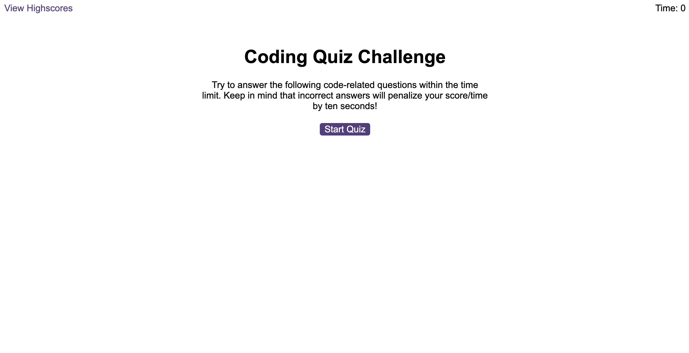

# Code-Quiz

Link to deployed app: https://daveym1.github.io/Code-Quiz/

## Description

A simple, 10 question quiz built using vanilla JavaScript. When the start button is clicked, the quiz starts. The timer starts, questions are displayed and a list of possible answers are shown. When you click on an answer you are taken to the next question. If the wrong answer is given, time will be deducted.

When the quiz is finished, your final score is displayed and you're prompted to input your initials to sdave your high score to local storage.

## Screenshot

